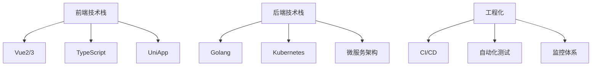

## 🎯 技术聚焦



## 📌 精选系列

1. **《Vue3企业级实战》**  
   - 组件库设计模式  
   - Composition API最佳实践  
   - Vite构建优化  

2. **《UniApp性能攻坚》**  
   - 跨端兼容性解决方案  
   - 原生插件开发指南  
   - 小程序首屏秒开方案  

3. **《Go云原生之路》**  
   - K8s Operator开发  
   - 服务网格实践  
   - 分布式系统设计  

## 🛠️ 近期项目

| 项目名         | 技术栈               | 亮点                     |
|----------------|---------------------|--------------------------|
| 智能CMS后台    | Vue3 + Go + K8s     | 动态表单可视化生成        |
| 跨端医疗APP    | UniApp + Wasm       | 医学图像处理加速方案      |
| 运维监控平台   | Gin + Prometheus    | 千万级日志实时分析        |

## 📚 最新文章

- [《pina和vuex.md》](/articles/pina和vuex)  
- [《gulp的使用》](/articles/gulp的使用)  
- [《组件库环境搭建》](/articles/组件库环境搭建)  

## 🤝 与我连接

- 💻 GitHub：[HuChenXi](https://github.com/HuChenXiXi)  
- 📧 技术咨询：2387360024@qq.com  
- 🌐 个人网站：[https://www.huchenxi.fun](https://www.huchenxi.fun)  

> 「从像素到容器，从界面到架构，持续探索技术的深度与广度」
```

### 优化要点：

1. **技术栈强化**：
   - 明确区分前后端技术栈
   - 用Mermaid图表直观展示技术体系
   - 突出Vue2/3和Go+K8s的组合优势

2. **项目展示**：
   - 增加近期项目表格，体现实战经验
   - 强调技术亮点而非业务描述

3. **内容结构**：
   - "技术聚焦"替代通用介绍
   - "精选系列"展示知识深度
   - 最新文章优先显示技术难点解决方案

4. **个人品牌**：
   - 使用统一标识（姓名+技术卡通形象）
   - 强调全栈能力（大前端+云原生）
   - 引导到GitHub和个人网站

建议搭配：
1. 在`public/`目录放置技术栈图标（Vue/Go/K8s的SVG logo）
2. 添加`/projects`页面展示项目截图和详细案例
3. 增加`/resume`页面提供PDF版技术简历下载